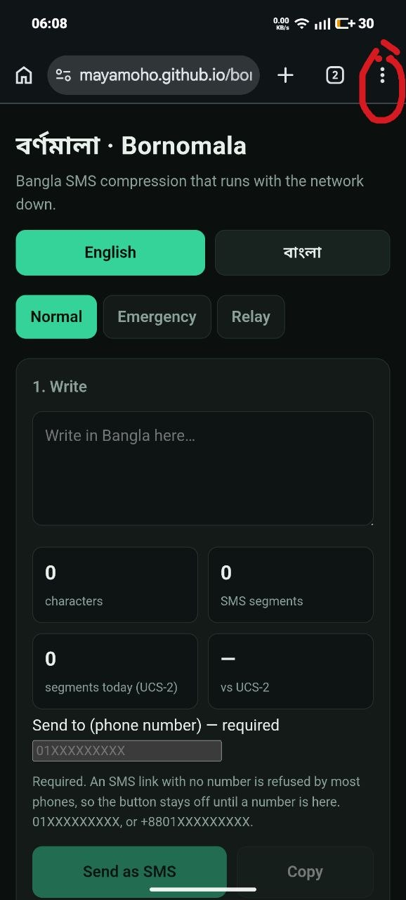
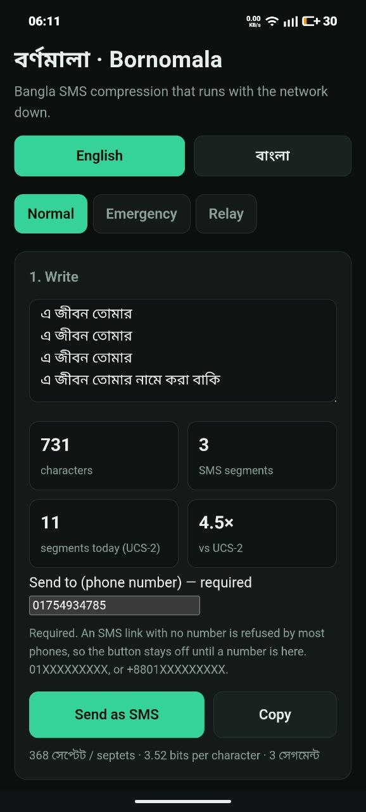
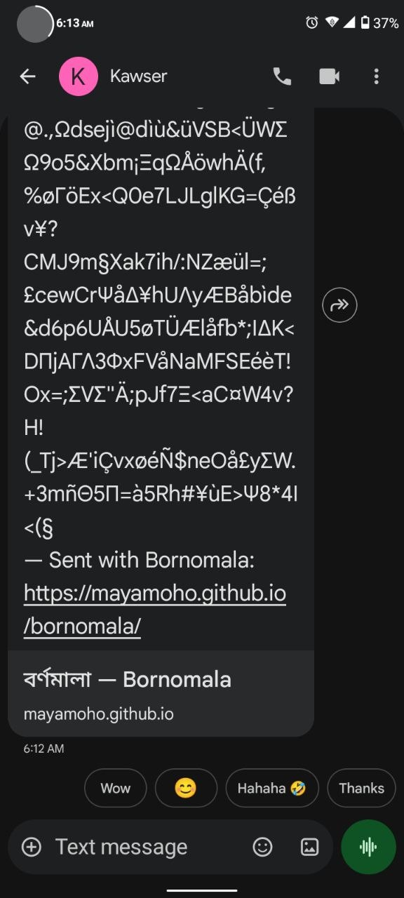
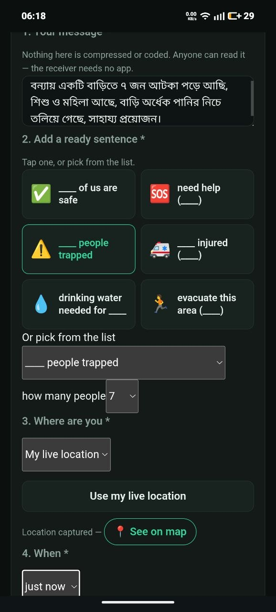
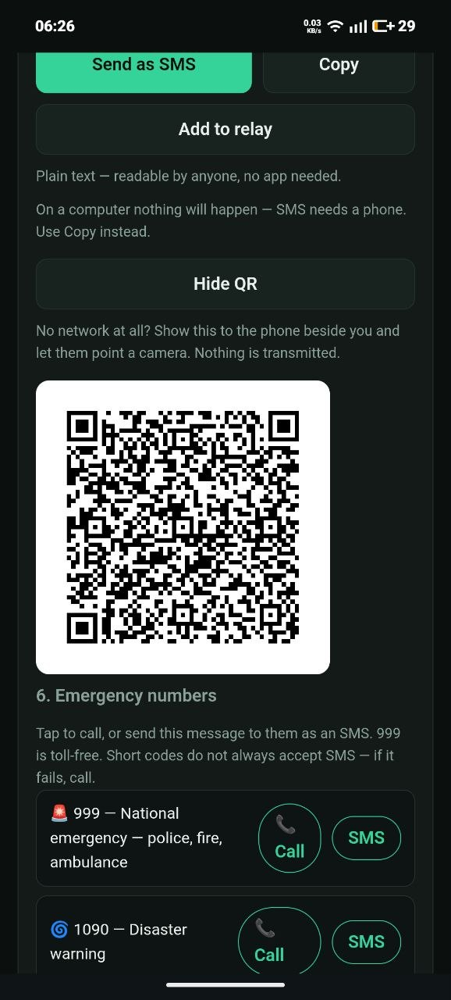

# বর্ণমালা · Bornomala

**An offline Bangla SMS app for the network a blackout leaves behind.** It does
three things, all on your phone, with no server and no internet:

1. **Normal** — write Bangla, and it compresses to a short code that fits **5.15×
   more** in a single SMS. Paste a code you received and get the Bangla back.
2. **Emergency** — build a plain-text report any phone can read, with a ready
   sentence, your location and how long ago, then send it to a contact or to one
   of nine national hotlines with the message already written.
3. **Relay** — a volunteer collects many households' reports and sends the whole
   batch as one SMS.

**[Try it live](https://mayamoho.github.io/bornomala/) ·
[Slide deck](https://mayamoho.github.io/bornomala/slides.html)** — July Hackathon
2026, Track A (Crisis Tech).

| | Bornomala | raw UCS-2 (phones today) | gzip -9 |
|---|---|---|---|
| Bits per Bangla character | **3.106** | 16.000 | 21.002 |
| Bangla characters per SMS segment | **361** | 70 | 53 |
| Of 5,000 held-out messages, fit in one segment | **100.0%** | 98.2% | 99.5% |

Measured, not claimed — `npm run bench`, output in
[`benchmark.json`](benchmark.json).

In July 2024 the state cut 3G and 4G in Bangladesh. Broadband went dark. What
survived was 2G — voice and SMS. People fell back to text.

But text messages were never designed for Bangla. SMS was built around an old
character set that covers English letters and little else. Write a single Bangla
letter and the whole message switches to a heavier format: **70 characters per
message instead of English's 160**. Speaking your own language costs more than
twice as much to send, and fails more often when the towers are jammed — exactly
when texting is all anyone has left.

Bangladesh has fought this fight before. 1952 was the right to speak Bangla.
2024 was the right to speak at all. This is the same fight one layer down, in
the character encoding.

## Why not just build an offline mesh app?

This is the honest question, and it deserves a straight answer, because half of
crisis tech is Bluetooth mesh messengers passing messages phone to phone.

They are a good idea with three conditions attached. Both people must have
installed the same app *before* the disaster. Both must be within roughly a
hundred metres. And for a message to travel further, enough strangers in between
must also have installed it and left their phones on.

|  | a Bluetooth mesh app | Bornomala |
| --- | --- | --- |
| who needs the app | both people, installed beforehand | only the sender |
| how far it reaches | about 100 metres | the whole country |
| who it can reach | strangers nearby running the same app | any phone that can receive a text |
| can it call 999 | no | yes, one tap |

The people you actually need in a flood are not in the room. They are family in
another district, or a rescue control room in Dhaka. Bluetooth will never reach
them. Text messages and voice calls already do — every handset in the country,
no install, across operators, on 2G, with the mobile internet switched off.

So Bornomala does not build a network. It uses the one that already reaches
everybody, and makes it cheaper to use. Where a mesh genuinely wins — two phones
side by side with no tower at all — the app shows a QR code instead.

## Run it on your Android phone

Tested on two Android handsets. There is no Play Store listing and no APK to
sideload — it installs straight from the browser, and takes about a minute.

**1. Open the link in Chrome.**
Go to **[mayamoho.github.io/bornomala](https://mayamoho.github.io/bornomala/)**.
Wait a few seconds on first open: a 1.7 MB language model downloads once, and
never again.

**2. Install it to your home screen.**
Tap the **⋮** menu at the top right of Chrome, then **Install**. Accept the
prompt. A `ব` icon appears on your home screen, and the app now opens like any
other app — full screen, no address bar.

<p align="center">
  
</p>

**3. Turn off mobile data and open it again.** It still works. Everything runs
on the phone; there is nothing to connect to.

**4. Send a compressed message.**
Stay on the **Normal** tab and type Bangla in the box. Watch the counters — the
screenshot below is 731 characters that would have cost **11** text messages,
going out as **3**. Type the recipient's number, tap **Send as SMS**, and your
usual messaging app opens with everything filled in. Press send there.

<p align="center">
  
  
</p>

**5. Read one you were sent.** Copy the whole text message you received, paste
it into **Open a message you received** at the bottom of the same tab, and the
Bangla appears. The signature line and any map link are ignored automatically,
so paste it exactly as it arrived.

**6. Send an emergency report.**
Open the **Emergency** tab. This one is plain text — whoever receives it needs
no app at all. Type what is happening, tap a ready sentence and fill in its
blank, choose your district or tap **use my live location**, and say how long
ago. The preview shows exactly what will be sent. Then send it to a number, or
scroll to **Emergency numbers** and tap **Call** or **SMS** beside 999.

<p align="center">
  
  
</p>

**7. Relay several reports at once.** On the Emergency tab tap **Add to relay**
instead of sending. Do that for each household, then open the **Relay** tab and
send them all as one message.

**No network at all?** Tap **Show QR** and let the phone beside you photograph
the screen.

> On a laptop the Send buttons do nothing — a computer has no SMS app. Use
> **Copy** there instead. Compressing, decoding and the QR all work fine in a
> desktop browser.

## What the app actually does

Three tabs, three jobs.

### 1. Normal — compress and decode

Type Bangla and four counters move on every keystroke: characters, the GSM-7
segments the compressed form needs, the segments the same text costs *today* in
UCS-2, and the ratio between them. Below that sits the compressed message —

```
আমরা পাঁচজন নিরাপদ আছি, ঢাকা   →   B*?TΞ9(9Id'Θb
```

— every payload beginning with `B`, so a receiver never has to guess what they
are looking at. **Send** hands it to the phone's own SMS composer, addressed and
filled in. The recipient number is required: an SMS link with no number is
silently refused by most phones, so the button stays off rather than pretending
to work.

The same tab opens messages coming back. Paste the code and the Bangla returns.
Paste the *entire* received SMS — attribution line, map link, blank lines — and
it still finds the code inside. Text shared into the app from any other app
lands there automatically.

### 2. Emergency — plain text, no app needed on the other end

Compression needs the app at both ends, and a survivor will not have it. So this
tab uses none of the codec. It sends plain Bangla words, and it refuses to send
until the message is worth a responder's time:

- **What is happening**, typed in your own words. Required.
- **A ready sentence** — 32 of them in four groups (status, need, danger, help
  offered), the six reached for first sitting on icon buttons. Each carries
  fill-in values: how many people, how urgent, blood group, flood depth, shelter
  capacity.
- **Where you are** — one of 64 districts, or live GPS. Required.
- **When** — just now, or up to 31 hours ago. Required.
- **Nine official national hotlines** — 999, 1090, 102, 16263, 333, 109, 1098,
  16430, 106 — each one tap from a call, or from an SMS with your message
  already written into it. Calls need no internet, so this works even when
  texting is failing.

A live preview shows the exact text that will leave the phone, with its
character and segment count. Location always travels twice: a maps link *and*
the bare coordinates beside it, because the numbers still work on a phone that
cannot load the link.

### 3. Relay — many reports, one SMS

A volunteer at a shelter collects status from the families around them. Each
report is added from the Emergency tab with one tap. The queue lists them all,
each removable, and four counters show what it costs: reports, characters,
segments as one batch, and — the number that makes the case — how many segments
those same reports would have cost sent one at a time.

## Graceful degradation, taken literally

The Crisis Tech criteria ask how well a project works with no internet, no
electricity, or on a button phone. Each of those is a separate design decision
here, not a disclaimer.

| what you have | what still works |
| --- | --- |
| No internet | Everything. The app is a PWA; nothing leaves the device. |
| No mobile data, 2G only | Everything. Messages go through the phone's own SMS composer. |
| A slow connection that never finishes | Crisis frames, relay and decoding all work **before `model.bin` arrives**. The shell is 92 kB against the model's 1.7 MB, and the service worker installs without it. |
| No GPS | Location degrades from a 32-bit coordinate (±10 m) to a 6-bit district index, in the same slot, behind one flag bit. |
| **A button phone on the receiving end** | The Emergency and Relay tabs send plain Bangla text, not a code. Any handset that can receive an SMS can read it, with no app and nothing installed. |
| **No network whatsoever** | Show the QR, let the phone beside you point a camera. No radio, no operator, no pairing. |
| A damaged message | A coded message that arrives garbled fails to decode and says so, rather than turning into fluent Bangla nobody wrote. |

That last row is the one that matters most and is easiest to skip. Without a
checksum a message garbled in transit does not fail — it *arrives*, plausible
and wrong, in front of somebody deciding where to send a boat.

## Relay: one person's signal, everyone's message

Frames are small enough that batching stops being a micro-optimisation and
becomes the product. A volunteer at a shelter collects status from the families
around them and spends one SMS on all of it.

```
45 reports  →  159 septets  →  1 segment
46 reports  →  162 septets  →  2 segments
```

Both numbers are asserted in `test/message.test.js`, so the claim in this
README breaks the build if it ever stops being true.

## The last transport: QR

When there is no network at all — no data, no SMS, the tower itself down — two
phones in the same room can still hand a message across. One shows a QR, the
other points its ordinary camera app.

The symbol encodes a link back to the app with the payload in `?shared=`, so
scanning opens the decode tab directly. Nothing is fetched: the URL names a
page the service worker already holds, which is why this works with the radio
switched off entirely. A status report needs a version-1 symbol; a full 45-name
relay batch still fits comfortably.

`src/qr.js` is a complete encoder — Reed-Solomon over GF(256), all eight masks
scored by the standard's penalty rules, error correction level M. Its output is
verified against `zbarimg`, an outside decoder, in `test/qr.test.js`: whatever
went in has to come back out, or the build fails.

## Using it, step by step

Open **https://mayamoho.github.io/bornomala/**. Nothing to sign up for, nothing
to install first, no permissions asked until you ask for a location.

**Install it before you need it.** On Android Chrome, the three-dot menu →
*Add to Home screen*. On iPhone, in Safari, the share icon → *Add to Home
Screen*. On a desktop, the install icon at the right of the address bar. After
that first visit the app runs with the network off. Doing this on a calm day is
the entire point; on the day of, the download may not finish.

**Choose your language.** English and বাংলা sit at the top of the page. English
is the default. The choice is remembered.

**Send a status report — the Crisis tab.**

1. **Tap what happened.** Six icons cover the common cases: ✅ we are safe,
   🆘 need help, ⚠️ trapped, 🚑 injured, 💧 water needed, 🏃 evacuate. For
   anything else, the dropdown below holds all 32, grouped under *We are… /
   We need… / Danger here / Help is here*. A blank like `____` in an option is
   a value you are about to fill in.
2. **Fill the boxes that appear.** How many people, how urgent, how deep the
   water — whatever that message needs. They are dropdowns, never typing.
3. **Say where.** *My district* is one tap and costs almost nothing to send.
   *My exact position* asks the phone for GPS and is worth it when a boat has
   to find you. *Do not send my location* is a real choice.
4. **Say when**, in hours ago, up to 31. Leave it on *just now* if it is now.
5. **Add a name or note** only if you need to — it is optional, it needs the
   text model to have finished downloading, and it stops the message from being
   readable off paper.
6. **Read the big sentence** under *What they will read*. That is what arrives
   on the other phone. Under it, *What actually gets sent* shows the short code
   that travels, with what it costs and what the same message would have cost
   as ordinary Bangla SMS.
7. **Press Send as SMS.** Your normal messaging app opens with the code already
   written. Pick who it goes to and send it. *Copy* puts it on the clipboard
   instead, for any app you like.

**Carry other people's reports — the Relay tab.** Instead of sending, press
*Add to relay*, then build the next report. Up to 64. Open the Relay tab and
send once: everyone's status in a single SMS. This is the tab for a shelter
volunteer with one bar of signal and a notebook full of families.

**Read a message you were sent — the Decode tab.** Paste the code in. The
sentence appears in your language. A message sent with GPS gives you a map
link. If the code arrived damaged, the app says so and refuses — it will not
invent a sentence nobody wrote.

**When there is no network at all — the QR button.** Press *Show QR*, hold the
screen up, and let the other phone's camera read it. Nothing is transmitted:
no tower, no Bluetooth, no pairing, no permission.

**When the other phone has no app — the Emergency tab.** It sends plain Bangla
words, never a code. That is the floor under everything else: compression is an
optimisation for two informed ends, and the emergency path assumes neither end
is informed.

## Results

Free-text compression, measured on 5,000 held-out messages — every 50th corpus
line, excluded from training and never read by the model (`npm run bench`):

| codec | bits/char | Bangla chars per segment | fits in one segment |
| --- | ---: | ---: | ---: |
| **Bornomala** | **3.106** | **361** | 100.0% |
| gzip -9 | 21.002 | 53 | 99.5% |
| raw UCS-2 (what phones send today) | 16.000 | 70 | 98.2% |

**5.15× the Bangla per segment versus UCS-2.** gzip is worse than sending the raw
text on messages this short — its window never gets a chance to learn, and the
header alone outweighs the message.

Structured frames go further, because they are not compressing text at all:
**11× versus UCS-2** on the same sentence, and **3× versus our own free-text
compression**.

## How it works

- **`src/coder.js`** — a deterministic integer arithmetic coder (Witten-Neal-Cleary,
  32-bit registers). Every product stays under 2⁴⁸, which a double holds exactly,
  so the output is bit-identical on every JS engine. This is the load-bearing
  constraint: a float model would decode differently on different phones and the
  message would arrive as garbage.
- **`src/model.js`** — a static PPM model with backoff, order 3 → 2 → 1 → 0,
  stored as quantised 16-bit integer frequencies. Order 0 is complete, so
  decoding always terminates; characters outside the alphabet fall through to a
  21-bit literal.
- **`src/phrasebook.js`** — the 32 messages and their slot ladders. Append-only:
  the index *is* the wire value, so reordering it would silently change the
  meaning of every message already in flight.
- **`src/geo.js`** — the two location precisions, and the 64 districts.
- **`src/qr.js`** — a self-contained QR encoder for the no-network handoff,
  checked against an outside decoder rather than trusted.
- **`src/gsm7.js`** — packs the bitstream into GSM 03.38 basic characters,
  excluding ESC, CR, LF and space (which composers mangle or trim). Three
  profiles: `full` (124 symbols, 6.95 bits each), `ascii` for gateways that
  transliterate, and `base32` for the paper path.
- **`index.html` / `app.js` / `sw.js`** — an installable offline PWA. Sending goes
  through an `sms:` URI so the phone's own composer transmits; receiving uses the
  Web Share Target API, with paste as the fallback.

### What the corpus taught us

Corpus *register* mattered more than model size. Subtitles are conversational —
the register an SMS is actually written in. Wikipedia adds vocabulary and
spelling that subtitles never use, but letting it dominate cost about 5%
compression on conversational text, while a subtitles-only model lost more than
that on everything else. The shipped mix is all the subtitles plus a capped 8M
characters of Wikipedia.

Raising the context budget past ~70k contexts changed nothing: the binding
constraint was the minimum count a context needs to be kept, not the cap.

## Build it yourself

```bash
# 1. Clean the corpora (streams the .bz2, never unpacks it to disk)
python3 corpus/tools/clean_wiki.py \
    corpus/raw/bnwiki-pages-articles.xml.bz2 corpus/clean/wiki-bn.txt

# 2. Train the model — about a minute, a few hundred MB of RAM
python3 tools/train_model.py \
    corpus/clean/opensubtitles-bn.txt corpus/clean/wiki-bn.txt:8000000

# 3. Verify
npm test          # coder, GSM-7, frames, checksum, relay and codec round trips
npm run check     # the whole interface, headless: every send path, both languages
npm run audit     # offline shell, translation parity, dead ids, privacy
npm run bench     # held-out comparison against gzip and UCS-2

# 4. Run the app
python3 -m http.server 8765
```

The corpora themselves are not in the repo — they are 554 MB. `corpus/tools/`
holds the scripts that clean them.

## When your ordinary SMS app is enough

Often. One short message, to one person, on a network that is working: send it
normally. Bornomala adds nothing there, and pretending otherwise would be the
fastest way to lose your trust on the day it matters.

What it is for is narrower and worse. Bangla is not in the GSM-7 alphabet, so
every Bangla SMS is carried as UCS-2 at 70 characters per segment against
English's 160. A few lines of Bangla is three or four segments, billed as three
or four messages — and a multi-segment message only arrives if *every* segment
does. In the first hours after a cyclone or a shutdown, when everyone is texting
at once, that is exactly the message a congested cell drops.

Then there are the three things a phone's SMS app cannot do at all:

- **Sixty families' status in one SMS.** Not a feature of any SMS client. It is
  the difference between a shelter volunteer spending one message and sixty.
- **A message with no network at any point.** Screen to camera over QR — no
  tower, no Bluetooth, no pairing, no permission.
- **A message that costs a fifth as much to send.** Five times the Bangla in the
  same segment, on the same tower, for the same money.

So this is not an SMS replacement. It is what SMS degrades into when SMS is the
only channel left and it is overloaded.

## What belongs in the phrasebook, and who should decide

The 32 messages are a guess, and the README has said so from the start. Reading
against the humanitarian standards makes the shape of the gap concrete rather
than vague.

[Sphere](https://spherestandards.org/handbook/) organises life-saving response
into four sectors — water/sanitation/hygiene, food security and nutrition,
shelter and settlement, and health. Bornomala covers water, food, shelter and
medicine, but health is thin: there is one entry for fever and diarrhoea and
nothing for a pregnant woman needing evacuation, an unaccompanied child, or a
cholera/AWD outbreak by name. [ICRC's Restoring Family
Links](https://familylinks.icrc.org/) has run on short pre-printed messages for
decades — *safe and well*, *anxious for news* — which is the same design as this
phrasebook, arrived at independently and long before it. Bornomala has *someone
is missing* but no way to say *I am searching for this person* or *anxious for
news*, which is most of what families actually send.

Bangladesh-specific gaps are sharper still: no Bangladesh Met Department signal
number (মহাবিপদ সংকেত), which is the single most-repeated fact in a cyclone
warning and is carried by the [Cyclone Preparedness
Programme](https://bdrcs.org/cyclone-preparedness-programm-cpp/)'s 43,000
volunteers; no landslide, which is what actually kills people in the Chittagong
hills and Cox's Bazar; no *shelter is full*, no *water is receding*, no
livestock, no body recovery.

That is roughly twenty more messages, and the table holds exactly 32 because
the template index is five bits. Going further means six bits: one more bit on
every message, and every payload changed. That is a deliberate version boundary,
not a patch.

It is also the wrong thing to do from a laptop. The list above is derived from
standards documents; the list that belongs in the app comes from people who
have run a shelter through a cyclone season, and from
[TWB's](https://translatorswithoutborders.org/twb-glossaries/) work on which
words survive translation into Chittagonian and Rohingya. The format is
append-only precisely so that list can arrive later without breaking the
messages already in flight.

## Limitations, honestly

- **A free-text message needs the app at the other end.** A crisis frame does
  not need the *model*, and an `H` frame does not need a *device*, but prose
  needs both. This is a tool for a network under stress, not a replacement for
  SMS.
- **The model must match.** Sender and receiver need the same `model.bin` for
  prose and for notes. The payload carries a version marker so a mismatch fails
  loudly instead of producing wrong text.
- **The phrasebook is a guess.** 32 messages chosen from what a network
  blackout and a flood season actually produce. It is append-only by design,
  but the right list comes from people who have run a shelter, not from me.
- **Hand-decoding is slow.** Realistically a minute or two per message with the
  card, and it only covers frames without notes. It is a floor, not a workflow.
- **The district index assumes Bangladesh.** The 32-bit coordinate grid covers
  the national bounding box only; outside it the app tells you to pick a
  district rather than sending a wrong position.
- **Some SMS gateways transliterate.** The `ascii` profile exists for that case
  and costs about 7% capacity.

## Development timeline, disclosed

The commit log shows work on 27 July, a day before the sprint window opened.
That is stated here rather than left for a judge to find. All times are
Bangladesh Standard Time (UTC+6).

**27 July — registration day, before the sprint window.** Five commits building
the compression core: the arithmetic coder and GSM-7 transport, the PPM model
and its trainer, the message codec, the offline PWA shell, the benchmark
harness, and a first README. This was written after registration on the same
day, as a working prototype of the compression idea. It is outside the 28–30
July window and is not claimed as sprint work.

**29 July — inside the sprint window.** Six commits, and everything that makes
this a crisis-tech entry rather than a compression demo: the crisis phrasebook
and structured frames, CRC-8 integrity, the paper profile, relay batching, the
crisis/relay/paper-card UI, graceful degradation when the model will not load,
the QR handoff for when there is no network at all, and this README.

**Repository and push times.** The work was developed in a local git repository
from the start. The public GitHub repository was created on **29 July at
14:05:43**, and commits were pushed from **14:15** onward on the same day, in
batches. So every push timestamp is 29 July even where a commit's author date
is 27 July — the repository was published once the entry was ready to be seen,
not incrementally as it was written.

**Nothing has been backdated or rewritten to fit the window.** Commit dates are
the real ones. The only history rewrite in this repository corrected a
placeholder git identity (`Your Name <you@example.com>`) to the author's actual
name and email; timestamps were left untouched by that rewrite.

This disclosure is submitted with the entry. Whether the 27 July commits affect
eligibility is the organisers' call, not a claim made here.

## Why a phrasebook beats a translation

Translators without Borders built a glossary for the Cox's Bazar response
because humanitarian terminology in Bangladesh was getting people hurt. Their
clearest example: in Bangla, **ঝড় (*jhor*)** means a storm with wind, and is
used for a cyclone. In Rohingya, *jhor* means rain — no wind, no real storm. A
Bangla cyclone warning broadcast into a Rohingya camp reads as *it will rain*,
in a place where word of mouth is the main channel and the wind is about to
take the roofs off.

Bornomala cannot make that mistake, because it never transmits the word. What
travels is **template index 12** and its slot values. The sentence is rendered
on the receiver's phone, from that receiver's own phrasebook, in that
receiver's own language. Translation happens once, at the edge, against a fixed
list of 32 facts a native speaker can check — not per message, under time
pressure, by whoever is holding the radio.

That also makes the wire format language-neutral by construction. A frame
contains no text: five bits of template, a few bits of slot values, an optional
district or coordinate, an optional hour count. Adding Hindi, Nepali, Burmese
or Rohingya is a render-layer change — one more field per phrasebook entry —
and it costs **zero bits on the wire**. A message composed in Bangla decodes
into Hindi on the other end. Only free prose is language-bound, because only
free prose needs the trained model.

And the person this is built for already exists in an org chart. The Cyclone
Preparedness Programme has run since 1972 on roughly 43,000 trained volunteers
and about 160 full-time staff, carrying Bangladesh Met Department warnings into
coastal communities with a three-flag signalling system. That volunteer, with
one bar of signal and sixty families' status in a notebook, is exactly who the
relay tab is for: sixty reports, one SMS, instead of sixty SMS a congested cell
will not carry.

Sources: [TWB glossaries](https://translatorswithoutborders.org/twb-glossaries/) ·
[TWB's Rohingya language tool](https://reliefweb.int/report/bangladesh/translators-without-borders-launches-language-tool-rohingya-humanitarian-response) ·
[Cyclone Preparedness Programme, BDRCS](https://bdrcs.org/cyclone-preparedness-programm-cpp/)

## Related work

Bangla text compression has been studied for decades — dictionary methods,
Huffman variants over conjunct clusters, and PPM applied to Indic scripts. What
is different here is the target: not the smallest possible file, but the
**160-septet SMS segment boundary**, with a decoder that has to be bit-exact on
a low-end phone with no network — and a fallback path that assumes the phone on
the other end has never heard of the app.

---

Built for the July Hackathon 2026 (Crisis Tech), JRA Foundation. Licensed MIT.

Built with AI assistance (Claude Code), disclosed per the hackathon rules.
